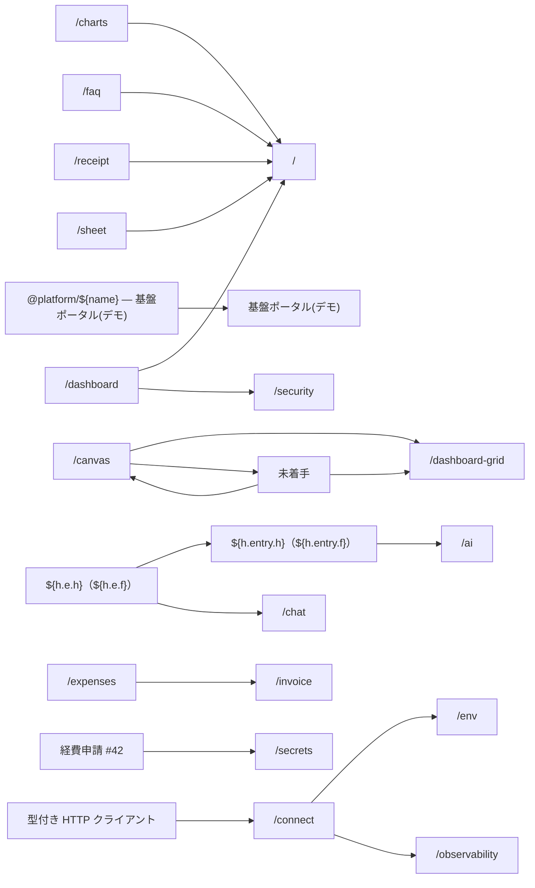

# showcase 画面・API 一覧(自動生成）

> 再生成: `node tools/gen-app-map.mjs showcase`。画面 93 / API 22。手で編集しない。

## 画面(93)

| パス | タイトル |
|---|---|
| `/` | — |
| `/access-review` | — |
| `/ai` | — |
| `/apikey` | — |
| `/approval` | — |
| `/apps/cart` | — |
| `/apps/crud` | CRUDテンプレート(デモ) |
| `/apps/equipment` | 備品管理(デモ) |
| `/apps/internal` | 社内アプリ(デモ) |
| `/apps/landing` | オリジナルノート A5 |
| `/apps/portal` | 基盤ポータル(デモ) |
| `/apps/portal/:name` | @platform/${name} — 基盤ポータル(デモ) |
| `/apps/site` | 公開サイト(デモ) |
| `/assistant` | ${h.entry.h}（${h.entry.f}） |
| `/attendance` | — |
| `/audit` | — |
| `/booking` | — |
| `/bulk` | — |
| `/cache` | — |
| `/calendar` | — |
| `/canvas` | — |
| `/charts` | — |
| `/chat` | — |
| `/chatbot` | ${h.e.h}（${h.e.f}） |
| `/cms` | — |
| `/code` | — |
| `/connect` | — |
| `/core` | — |
| `/dashboard` | — |
| `/dashboard-grid` | — |
| `/data-console` | — |
| `/dencho` | — |
| `/depreciation` | — |
| `/device` | — |
| `/elearning` | 情報セキュリティ研修 2026 |
| `/env` | — |
| `/error-pages` | — |
| `/examples/accounting-sync` | 会計連携(freee)(使用例) |
| `/examples/blueprint-workflow` | ブループリント(業務プロセス)(使用例) |
| `/examples/board-threads` | 掲示板ロジック(使用例) |
| `/examples/cast-site` | キャスト紹介サイト(使用例) |
| `/examples/chat-room` | チャットロジック(使用例) |
| `/examples/loadtest-scenarios` | 負荷試験(使用例) |
| `/examples/notify-channels` | 通知の使い分け(使用例) |
| `/examples/payslip-pdf` | 給与明細PDF(使用例) |
| `/examples/workplace-ops` | 情シスの朝の30秒(使用例) |
| `/expense-request` | — |
| `/expenses` | — |
| `/faker` | — |
| `/faq` | — |
| `/files` | — |
| `/flags` | — |
| `/freee` | — |
| `/icons` | — |
| `/import-history` | — |
| `/inquiries` | — |
| `/integrations` | 型付き HTTP クライアント |
| `/inventory` | — |
| `/invoice` | — |
| `/japanese-form` | — |
| `/jobs` | — |
| `/kanban` | 未着手 |
| `/lending` | — |
| `/line` | 経費申請 #42 |
| `/logger` | — |
| `/login` | — |
| `/master` | — |
| `/media` | — |
| `/meeting-room` | — |
| `/microsoft` | — |
| `/modal` | 品目の編集 |
| `/net` | — |
| `/notion` | — |
| `/observability` | — |
| `/payments` | — |
| `/paypal` | — |
| `/pii` | — |
| `/quote` | — |
| `/receipt` | — |
| `/rpa` | — |
| `/safe-html` | — |
| `/schedule` | 朝会 |
| `/secrets` | — |
| `/security` | — |
| `/sheet` | — |
| `/status-page` | メンテナンス中 |
| `/theme` | テーマ機構 — 基盤ショーケース |
| `/toolbox` | — |
| `/ui` | — |
| `/utils` | — |
| `/webhook` | — |
| `/widgets` | — |
| `/ws` | — |

## 画面遷移(19 遷移)

## API(22)

| エンドポイント | メソッド |
|---|---|
| `/api/address` | GET |
| `/api/assistant` | POST |
| `/api/connect-test` | POST |
| `/api/csrf` | GET |
| `/api/dencho-demo` | POST |
| `/api/download/:key` | GET |
| `/api/ekyc-demo` | POST |
| `/api/health` | GET |
| `/api/inquiries` | GET, POST |
| `/api/inquiries/export` | GET |
| `/api/line-demo` | POST |
| `/api/login` | POST |
| `/api/logout` | POST |
| `/api/me` | GET |
| `/api/media-probe` | POST |
| `/api/password` | GET, POST |
| `/api/password-reset-demo` | POST |
| `/api/register` | POST |
| `/api/slack-events` | POST |
| `/api/twofactor-demo` | POST |
| `/api/upload` | POST |
| `/api/webhook-demo` | GET, POST |
