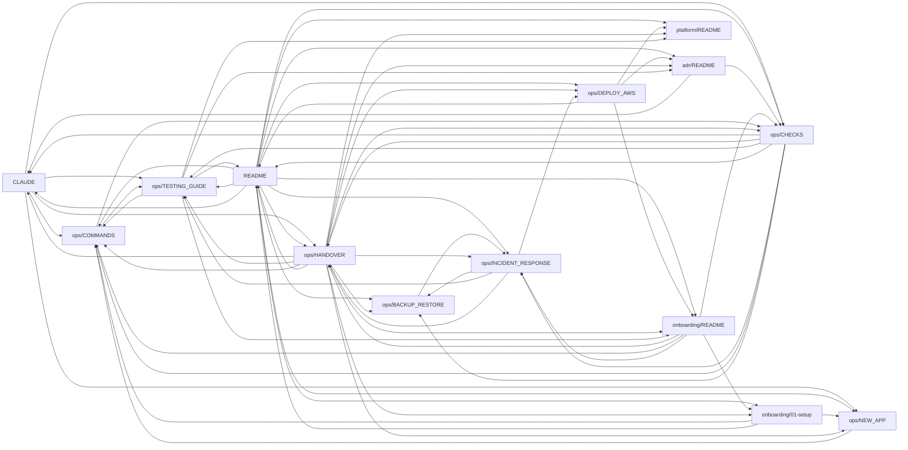

# 資料の参照関係

> **この資料は自動生成です。手で編集しないでください。**
> 作り直す: `node tools/gen-docs-graph.mjs`

**82 件**の資料が、どう参照し合っているかを示します
（生成物は除いています）。

## 読み方

- **参照される数が多い** = **終点**。多くの資料が「詳しくはここへ」と指している
- **参照する数が多い** = **入口**。他を案内する役割
- **どちらも 0** = **孤立**。`check-docs-orphans` が別途見張っています

## よく参照される資料（上位 10）

| 資料 | 参照される | 参照する |
|---|---|---|
| `ops/HANDOVER` | 15 | 36 |
| `ops/CHECKS` | 15 | 11 |
| `ops/BACKUP_RESTORE` | 14 | 4 |
| `ops/COMMANDS` | 11 | 3 |
| `CLAUDE` | 10 | 6 |
| `ops/INCIDENT_RESPONSE` | 10 | 6 |
| `README` | 9 | 47 |
| `ops/TESTING_GUIDE` | 9 | 9 |
| `onboarding/01-setup` | 8 | 7 |
| `ops/NEW_APP` | 8 | 2 |

## 図

## 相互に参照し合っている組

**39 組**あります。お互いを指し合うのは、
**役割が曖昧**か、**片方に寄せられる**可能性を示します
（ただし「概要 ↔ 詳細」のように意図的な場合もあります）。

| | |
|---|---|
| `CLAUDE` | `ops/CURSOR_GUIDE` |
| `CLAUDE` | `ops/CHECKS` |
| `CLAUDE` | `ops/HANDOVER` |
| `CONTRIBUTING` | `ops/GIT_GUIDE` |
| `README` | `README` |
| `README` | `ops/HANDOVER` |
| `HISTORY` | `ops/HANDOVER` |
| `README` | `ops/APP_EXTRACTION` |
| `README` | `onboarding/01-setup` |
| `README` | `onboarding/03-development` |
| `README` | `ops/TESTING_GUIDE` |
| `README` | `ops/CHECKS` |
| `README` | `ops/PACKAGE_CONSOLIDATION` |
| `README` | `ops/DEPLOY_AWS` |
| `RUNBOOK` | `ops/SUPPORT_GUIDE` |
| `adr/0011-no-versioning-monorepo` | `adr/0026-app-repos-and-platform-versioning` |
| `adr/0013-db-push-not-migrations` | `adr/0014-migration-baseline-on-production` |
| `adr/0014-migration-baseline-on-production` | `ops/BACKUP_RESTORE` |
| `adr/0015-package-consolidation-policy` | `ops/PACKAGE_CONSOLIDATION` |
| `adr/0017-access-review` | `ops/ACCESS_CONTROL` |
| `adr/0018-data-retention` | `ops/BACKUP_RESTORE` |
| `onboarding/01-setup` | `onboarding/03-development` |
| `onboarding/03-development` | `ops/CURSOR_GUIDE` |
| `onboarding/05-verify` | `ops/CHECKS` |
| `onboarding/README` | `ops/HANDOVER` |
| `ops/APP_EXTRACTION` | `ops/HANDOVER` |
| `ops/BACKUP_RESTORE` | `ops/INCIDENT_RESPONSE` |
| `ops/CHECKS` | `ops/HANDOVER` |
| `ops/CHECKS` | `ops/COMMANDS` |
| `ops/COMMANDS` | `ops/TESTING_GUIDE` |
| `ops/DATA_MIGRATION` | `ops/HANDOVER` |
| `ops/DEVTOOLS_GUIDE` | `ops/TESTING_GUIDE` |
| `ops/EXTERNAL_REVIEW_2026-08` | `ops/HANDOVER` |
| `ops/EXTERNAL_REVIEW_2026-08` | `ops/EXTERNAL_REVIEW_2026-08_RAW` |
| `ops/GITHUB_ACTIONS` | `ops/HANDOVER` |
| `ops/HANDOVER` | `ops/LOAD_TESTING` |
| `ops/HANDOVER` | `ops/INCIDENT_RESPONSE` |
| `ops/HANDOVER` | `ops/SLOW_TRIAGE` |

## 全件

| 資料 | 参照される | 参照する |
|---|---|---|
| `ops/HANDOVER` | 15 | 36 |
| `ops/CHECKS` | 15 | 11 |
| `ops/BACKUP_RESTORE` | 14 | 4 |
| `ops/COMMANDS` | 11 | 3 |
| `CLAUDE` | 10 | 6 |
| `ops/INCIDENT_RESPONSE` | 10 | 6 |
| `README` | 9 | 47 |
| `ops/TESTING_GUIDE` | 9 | 9 |
| `onboarding/01-setup` | 8 | 7 |
| `ops/NEW_APP` | 8 | 2 |
| `adr/README` | 7 | 29 |
| `onboarding/README` | 7 | 12 |
| `ops/DEPLOY_AWS` | 7 | 5 |
| `platform/README` | 7 | 1 |
| `README` | 6 | 21 |
| `onboarding/03-development` | 6 | 11 |
| `adr/0011-no-versioning-monorepo` | 6 | 2 |
| `ops/GITHUB_ACTIONS` | 6 | 2 |
| `APPS_AND_DEMOS` | 6 | 0 |
| `platform/CATALOG` | 6 | 0 |
| `HISTORY` | 5 | 7 |
| `ops/PACKAGE_CONSOLIDATION` | 5 | 7 |
| `ops/SUPPORT_GUIDE` | 5 | 4 |
| `ops/CURSOR_GUIDE` | 5 | 2 |
| `CONTRIBUTING` | 4 | 4 |
| `adr/0014-migration-baseline-on-production` | 4 | 3 |
| `onboarding/04-task` | 4 | 3 |
| `ops/ACCESS_CONTROL` | 4 | 3 |
| `onboarding/05-verify` | 4 | 2 |
| `ops/DEVTOOLS_GUIDE` | 4 | 1 |
| `ops/GIT_GUIDE` | 4 | 1 |
| `ops/LOAD_TESTING` | 4 | 1 |
| `DATABASE` | 4 | 0 |
| `ops/APP_EXTRACTION` | 3 | 7 |
| `ops/EXTERNAL_REVIEW_2026-08` | 3 | 6 |
| `adr/0015-package-consolidation-policy` | 3 | 4 |
| `onboarding/02-first-hour` | 3 | 4 |
| `ops/ENVIRONMENTS` | 3 | 4 |
| `ops/SECRET_ROTATION` | 3 | 3 |
| `ops/SLOW_TRIAGE` | 3 | 3 |
| `RUNBOOK` | 3 | 2 |
| `ops/DATA_MIGRATION` | 3 | 2 |
| `ops/MAIL_DELIVERABILITY` | 3 | 2 |
| `adr/0013-db-push-not-migrations` | 3 | 1 |
| `adr/0018-data-retention` | 3 | 1 |
| `adr/0002-platform-app-separation` | 3 | 0 |
| `adr/0017-access-review` | 2 | 2 |
| `adr/0026-app-repos-and-platform-versioning` | 2 | 2 |
| `ops/APPLY_2026-08` | 2 | 2 |
| `adr/0016-two-factor-and-sso` | 2 | 1 |
| `ops/APPS_VS_FOUNDATION` | 2 | 1 |
| `ops/DEPLOY_DEMO_AMPLIFY` | 2 | 1 |
| `adr/0012-performance-targets` | 2 | 0 |
| `ops/CRON_JOBS` | 2 | 0 |
| `ops/RAG_PGVECTOR_MIGRATION` | 2 | 0 |
| `adr/0004-production-stores-and-lifecycle` | 1 | 1 |
| `adr/0005-connector-token-management` | 1 | 1 |
| `adr/0006-prisma7-driver-adapter` | 1 | 1 |
| `adr/0009-deploy-conoha-first-aws-next` | 1 | 1 |
| `adr/0020-web-storage-package` | 1 | 1 |
| `adr/0021-handover-split-platform-and-apps` | 1 | 1 |
| `adr/0023-package-tier` | 1 | 1 |
| `adr/0024-wire-up-policy` | 1 | 1 |
| `adr/0025-nextjs-15` | 1 | 1 |
| `ops/EXTERNAL_REVIEW_2026-08_RAW` | 1 | 1 |
| `ops/UPSTREAM_IMPORT` | 1 | 1 |
| `DEVELOPMENT` | 1 | 0 |
| `adr/0001-record-architecture-decisions` | 1 | 0 |
| `adr/0003-resilience-observability-primitives` | 1 | 0 |
| `adr/0007-dual-store-memory-prisma` | 1 | 0 |
| `adr/0008-mcp-minimal-inhouse` | 1 | 0 |
| `adr/0010-ai-gateway-required` | 1 | 0 |
| `adr/0019-jst-calendar-day` | 1 | 0 |
| `adr/0022-check-limit-baseline` | 1 | 0 |
| `adr/template` | 1 | 0 |
| `onboarding/apply-zip` | 1 | 0 |
| `onboarding/tailwind` | 1 | 0 |
| `ops/AUDIT_REVIEW` | 1 | 0 |
| `ops/UI_MIGRATION` | 1 | 0 |
| `platform/CHAT` | 1 | 0 |
| `platform/ROADMAP` | 0 | 0 |
| `platform/depgraph` | 0 | 0 |
