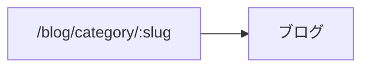

# public-site 画面・API 一覧(自動生成）

> 再生成: `node tools/gen-app-map.mjs public-site`。画面 10 / API 3。手で編集しない。

## 画面(10)

| パス | タイトル |
|---|---|
| `/` | — |
| `/:slug` | — |
| `/blog` | ブログ |
| `/blog/:slug` | — |
| `/blog/category/:slug` | — |
| `/blog/tag/:tag` | #${decodeURIComponent(tag)} の記事 |
| `/contact` | お問い合わせ |
| `/preview/:slug` | プレビュー |
| `/reviews` | お客様の声 |
| `/search` | 検索結果 |

## 画面遷移(1 遷移)

## API(3)

| エンドポイント | メソッド |
|---|---|
| `/api/contact` | POST |
| `/feed.xml` | GET |
| `/sitemap.xml` | GET |
