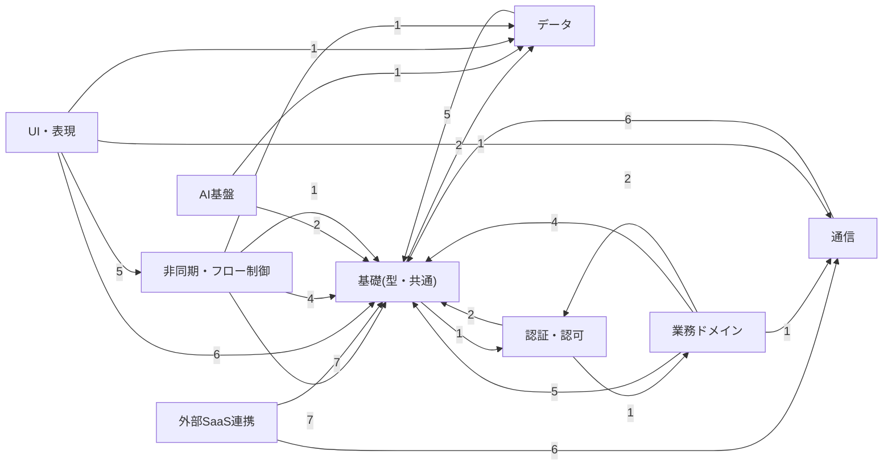

# パッケージ依存グラフ(自動生成）

> 再生成: `node tools/gen-depgraph.mjs`。手で編集しない。

## カテゴリ間の依存

各カテゴリのパッケージが、他カテゴリのパッケージを何本 import しているか（数字は本数）。

## よく使われる基盤パッケージ(被依存トップ12)

| パッケージ | 被依存数 |
|---|---|
| `@platform/core` | 50 |
| `@platform/integrations` | 7 |
| `@platform/tax` | 2 |
| `@platform/cache` | 2 |
| `@platform/auth` | 2 |
| `@platform/datetime` | 2 |
| `@platform/bluetooth` | 2 |
| `@platform/invoice` | 2 |
| `@platform/storage` | 2 |
| `@platform/fsm` | 1 |
| `@platform/board` | 1 |
| `@platform/site` | 1 |

## 依存が多いパッケージ(依存元トップ12)

| パッケージ | 依存数 |
|---|---|
| `@platform/ui` | 12 |
| `@platform/guard` | 4 |
| `@platform/testing` | 3 |
| `@platform/address` | 2 |
| `@platform/cms` | 2 |
| `@platform/db` | 2 |
| `@platform/ekyc` | 2 |
| `@platform/freee` | 2 |
| `@platform/google` | 2 |
| `@platform/invoice` | 2 |
| `@platform/line` | 2 |
| `@platform/paypal` | 2 |
