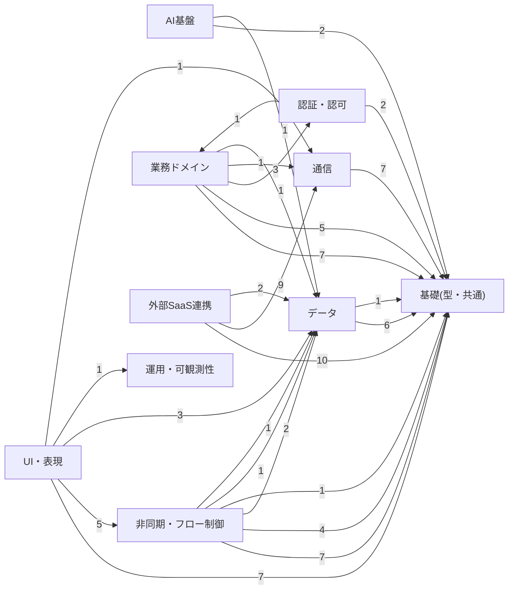

# パッケージ依存グラフ(自動生成）

> 再生成: `node tools/gen-depgraph.mjs`。手で編集しない。

## カテゴリ間の依存

各カテゴリのパッケージが、他カテゴリのパッケージを何本 import しているか（数字は本数）。

```mermaid
flowchart LR
  CAI__["AI基盤"]
  CUI___["UI・表現"]
  C___["その他"]
  C_________["コンテンツ・サイト"]
  C______["セキュリティ"]
  C___["データ"]
  C_________["メディア・デバイス"]
  C________["基礎(型・共通)"]
  C__SaaS__["外部SaaS連携"]
  C______["業務ドメイン"]
  C_____["認証・認可"]
  C__["通信"]
  C_______["運用・可観測性"]
  C_________["非同期・フロー制御"]
  C__SaaS__ -->|10| C________
  C__SaaS__ -->|9| C__
  C______ -->|7| C________
  CUI___ -->|7| C________
  C_________ -->|7| C________
  C__ -->|7| C________
  C___ -->|6| C________
  C______ -->|5| C________
  CUI___ -->|5| C_________
  C_________ -->|4| C________
  C______ -->|3| C_____
  CUI___ -->|3| C___
  CAI__ -->|2| C________
  C_____ -->|2| C________
  C_________ -->|2| C___
  C__SaaS__ -->|2| C___
  C______ -->|1| C__
  C_________ -->|1| C________
  C___ -->|1| C________
  CAI__ -->|1| C___
  C______ -->|1| C___
  C_____ -->|1| C______
  CUI___ -->|1| C_______
  CUI___ -->|1| C__
  C_________ -->|1| C___
  C_________ -->|1| C___
```

## よく使われる基盤パッケージ(被依存トップ12)

| パッケージ | 被依存数 |
|---|---|
| `@platform/core` | 57 |
| `@platform/integrations` | 10 |
| `@platform/bytes` | 4 |
| `@platform/datetime` | 3 |
| `@platform/auth` | 2 |
| `@platform/feed` | 2 |
| `@platform/tax` | 2 |
| `@platform/web-storage` | 2 |
| `@platform/bluetooth` | 2 |
| `@platform/invoice` | 2 |
| `@platform/payroll` | 1 |
| `@platform/url` | 1 |

## 依存が多いパッケージ(依存元トップ12)

| パッケージ | 依存数 |
|---|---|
| `@platform/ui` | 15 |
| `@platform/guard` | 4 |
| `@platform/google` | 3 |
| `@platform/paypal` | 3 |
| `@platform/upload` | 3 |
| `@platform/access-review` | 2 |
| `@platform/address` | 2 |
| `@platform/attendance` | 2 |
| `@platform/blog` | 2 |
| `@platform/cms` | 2 |
| `@platform/db` | 2 |
| `@platform/ekyc` | 2 |
