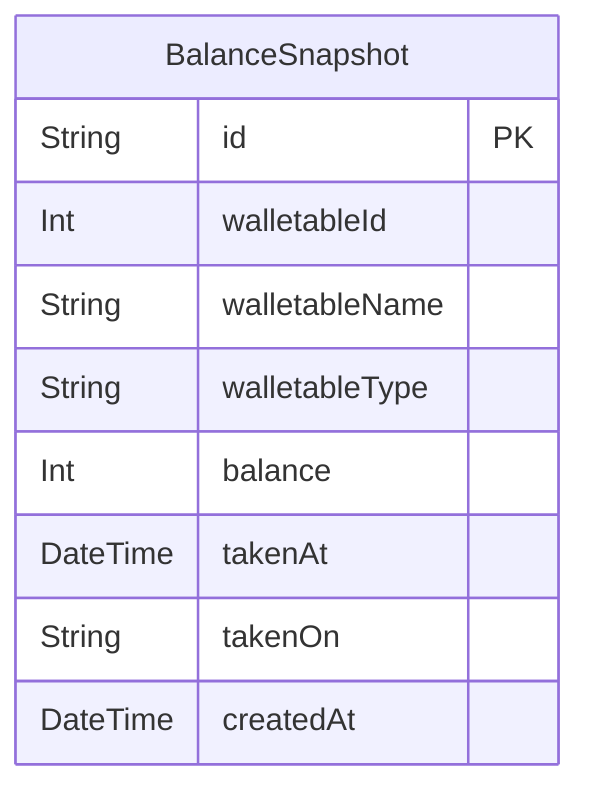

# balance-app ER 図(自動生成）

> 再生成: `node tools/gen-erd.mjs balance-app`。model 1 / リレーション 0。手で編集しない。

```mermaid
erDiagram
  BalanceSnapshot {
    String id PK
    Int walletableId
    String walletableName
    String walletableType
    Int balance
    DateTime takenAt
    String takenOn
    DateTime createdAt
  }
```
