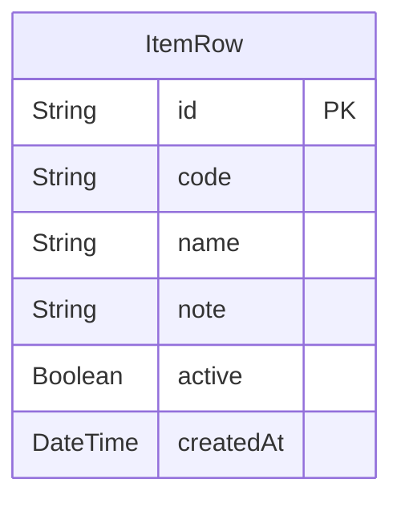

# crud-template ER 図(自動生成）

> 再生成: `node tools/gen-erd.mjs crud-template`。model 1 / リレーション 0。手で編集しない。

```mermaid
erDiagram
  ItemRow {
    String id PK
    String code
    String name
    String note
    Boolean active
    DateTime createdAt
  }
```
