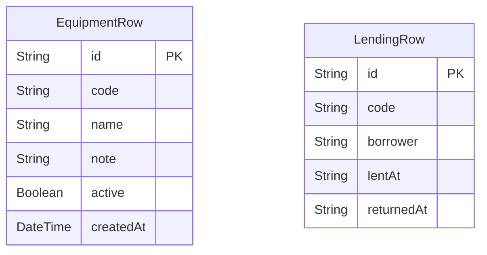

# equipment-app ER 図(自動生成）

> 再生成: `node tools/gen-erd.mjs equipment-app`。model 2 / リレーション 0。手で編集しない。

```mermaid
erDiagram
  EquipmentRow {
    String id PK
    String code
    String name
    String note
    Boolean active
    DateTime createdAt
  }
  LendingRow {
    String id PK
    String code
    String borrower
    String lentAt
    String returnedAt
  }
```
