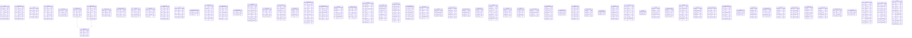

# internal-app ER 図(自動生成）

> 再生成: `node tools/gen-erd.mjs internal-app`。model 65 / リレーション 2。手で編集しない。

```mermaid
erDiagram
  Expense {
    String id PK
    DateTime date
    String category
    Int amount
    String note
    String batchId
    DateTime createdAt
    DateTime updatedAt
  }
  ExpenseRequest {
    String id PK
    String applicant
    String expenseId
    String status
    Int currentStep
    Json history
    DateTime createdAt
    DateTime updatedAt
  }
  AuditLog {
    String id PK
    String actor
    String action
    String target
    Json metadata
    DateTime createdAt
  }
  ImportBatch {
    String id PK
    String source
    String userId
    Int total
    Int inserted
    Int errorCount
    String status
    DateTime createdAt
  }
  SystemSetting {
    String key PK
    Json value
    String updatedBy
    DateTime updatedAt
  }
  ChatRoomRow {
    String id PK
    String name
    String kind
    DateTime createdAt
  }
  RoomMemberRow {
    String id PK
    String roomId
    String userId
    String role
    DateTime joinedAt
  }
  ChatMessageRow {
    String id PK
    String roomId
    String senderId
    String text
    DateTime at
    String replyTo
    DateTime editedAt
    Json attachments
  }
  MessageReadRow {
    String id PK
    String userId
    String roomId
    DateTime lastReadAt
  }
  MessageReactionRow {
    String id PK
    String messageId
    String userId
    String kind
    DateTime createdAt
  }
  PinRow {
    String id PK
    String roomId
    String messageId
    String pinnedBy
    DateTime pinnedAt
  }
  BookmarkRow {
    String id PK
    String userId
    String messageId
    String roomId
    DateTime at
  }
  NotificationRow {
    String id PK
    String userId
    String title
    String body
    String href
    String kind
    Boolean read
    DateTime createdAt
  }
  FileRow {
    String key PK
    String name
    Int size
    String type
    String uploadedBy
    DateTime uploadedAt
  }
  NotificationPreferenceRow {
    String userId PK
    Json defaultChannels
    Json categories
  }
  AuditEntryRow {
    Int seq PK
    DateTime at
    String actor
    String action
    String target
    Json before
    Json after
    String prevHash
    String hash
  }
  AnalyticsEventRow {
    String id PK
    String type
    String path
    String sessionId
    String userId
    String referrer
    String name
    DateTime at
  }
  DashboardPrefRow {
    String userId PK
    Json widgets
    DateTime updatedAt
  }
  CmsPostRow {
    String slug PK
    String title
    String categoryId
    String excerpt
    String eyecatch
    String body
    Json tags
    String status
    DateTime publishedAt
    DateTime updatedAt
  }
  CmsPageRow {
    String slug PK
    String title
    Json blocks
    String status
    DateTime updatedAt
  }
  AnnouncementRow {
    String id PK
    String message
    DateTime startAt
    DateTime endAt
    Json paths
    String ctaLabel
    String ctaHref
    String level
    DateTime createdAt
  }
  CategoryRow {
    String id PK
    String name
    String slug
    String parentId
    Int order
  }
  CmsRevisionRow {
    String id PK
    String postSlug
    Int version
    String title
    String body
    String categoryId
    String excerpt
    String eyecatch
    Json tags
    String status
    DateTime publishedAt
    String savedBy
    DateTime savedAt
  }
  PublishRequestRow {
    String id PK
    String postSlug
    String requestedBy
    DateTime requestedAt
    String status
    String decidedBy
    DateTime decidedAt
    String note
  }
  ProductRow {
    String sku PK
    String name
    String unit
    Int safetyStock
    Float dailyDemand
    Int leadTimeDays
    Int targetLevel
  }
  StockMovementRow {
    String id PK
    String sku
    String type
    Float quantity
    DateTime at
    String ref
    Float unitCost
  }
  InvoiceRow {
    String number PK
    String issueDate
    String dueDate
    String registrationNumber
    String billTo
    Json lines
    Float subtotal
    Float tax
    Float total
    Boolean issued
    Float paidAmount
    Boolean cancelled
  }
  QuoteRow {
    String number PK
    String issueDate
    String validUntil
    String billTo
    Json lines
    Float subtotal
    Float tax
    Float total
    String state
  }
  PurchaseOrderRow {
    String number PK
    String orderDate
    String supplier
    String dueDate
    Json lines
    Json skus
    Json receipts
    Float subtotal
    Float tax
    Float total
    String state
  }
  RecurringPlanRow {
    String number PK
    String billTo
    String interval
    String startDate
    String endDate
    Json lines
    String lastBilled
    Boolean active
  }
  AttendanceRow {
    String id PK
    String userId
    String date
    String clockIn
    String clockOut
    Int breakMinutes
    Boolean isHoliday
  }
  WageRow {
    String userId PK
    Float hourlyWage
    Json allowances
    Json deductions
  }
  AttendanceApprovalRow {
    String id PK
    String userId
    String month
    String status
    String submittedAt
    Json history
  }
  PurchasePaymentRow {
    String id PK
    String poNumber
    Float amount
    String paidAt
  }
  FeePaymentRow {
    String id PK
    String payee
    String category
    Float base
    String paidAt
  }
  AssetRow {
    String code PK
    String name
    String acquiredOn
    Float cost
    Int usefulLifeYears
    String method
    String disposedOn
    String disposalType
    Float proceeds
  }
  BudgetRow {
    String id PK
    String department
    String category
    String period
    Float amount
  }
  PartnerRow {
    String code PK
    String name
    String kinds
    String contact
    String note
  }
  InvoiceReceiptRow {
    String id PK
    String invoiceNumber
    Float amount
    String receivedAt
  }
  DocApprovalRow {
    String id PK
    String docType
    String docNumber
    Float amount
    String status
    Int currentStep
    String submittedAt
    Json history
  }
  PeriodLockRow {
    String period PK
    String lockedAt
    String lockedBy
  }
  MailboxRow {
    String id PK
    String owner
    String from
    String to
    String subject
    String body
    String sentAt
    Boolean read
  }
  ManualJournalRow {
    String id PK
    String date
    String description
    Json lines
  }
  AccountMasterRow {
    String account PK
    String type
  }
  InquiryRow {
    String id PK
    String name
    String email
    String category
    String subject
    String message
    String status
    String createdAt
  }
  UserRow {
    String email PK
    String name
    String department
    String roles
    String permissions
    Boolean active
    String createdAt
    String passwordHash
    String passwordSetAt
  }
  SettingRow {
    String key PK
    String value
  }
  SurveyRow {
    String id PK
    String title
    String description
    Json questions
    String status
    Json audience
  }
  SurveyResponseRow {
    String id PK
    String surveyId
    String respondent
    Json answers
    String submittedAt
  }
  ReviewRow {
    String id PK
    String subjectType
    String subjectId
    String author
    Int rating
    String title
    String comment
    Boolean hidden
    String createdAt
  }
  SignatureRow {
    String id PK
    String subjectType
    String subjectId
    String signer
    String image
    String signedAt
  }
  WebhookSubscriptionRow {
    String id PK
    String url
    String events
    String secret
    Boolean active
    String createdAt
  }
  ServiceAccountRow {
    String id PK
    String name
    String hash
    String displayPrefix
    String scopes
    Boolean active
    String createdAt
    String lastUsedAt
  }
  SecretRow {
    String name PK
    String ciphertext
    String updatedAt
  }
  SearchDocRow {
    String id PK
    String type
    String title
    String subtitle
    String href
    String text
  }
  ExportScheduleRow {
    String id PK
    String type
    String frequency
    Boolean enabled
    String lastRunAt
  }
  ExportRunRow {
    String id PK
    String type
    String at
    String status
    Int recordCount
    String note
  }
  ReportScheduleRow {
    String id PK
    String reportType
    String frequency
    String recipient
    Boolean enabled
    String lastSentAt
  }
  ReportPresetRow {
    String id PK
    String owner
    String name
    String reportType
    String fromDate
    String toDate
    String partner
  }
  DeliveryLogRow {
    String id PK
    String at
    String reportType
    String recipients
    Int recipientCount
    String status
  }
  GlossaryReplacement {
    String from PK
    String to
    String updatedBy
    DateTime updatedAt
  }
  GlossaryTerm {
    String term PK
    String createdBy
    DateTime createdAt
  }
  Task {
    String id PK
    String title
    String description
    String status
    String priority
    String assignee
    DateTime dueDate
    String projectId
    String parentId
    Int estimateHours
    Int actualHours
    DateTime createdAt
    DateTime updatedAt
  }
  Faq {
    String id PK
    String question
    String answer
    String category
    String_arr keywords
    String status
    Int helpful
    Int notHelpful
    Int views
    String_arr relatedIds
    DateTime createdAt
    DateTime updatedAt
  }
  Contract {
    String id PK
    String title
    String partner
    String status
    DateTime startDate
    DateTime endDate
    String renewalType
    Int renewalMonths
    Int noticeDays
    Int amount
    String owner
    String documentRef
    DateTime createdAt
    DateTime updatedAt
  }
  RoomMemberRow }|--|| ChatRoomRow : "room"
  ChatMessageRow }|--|| ChatRoomRow : "room"
```
